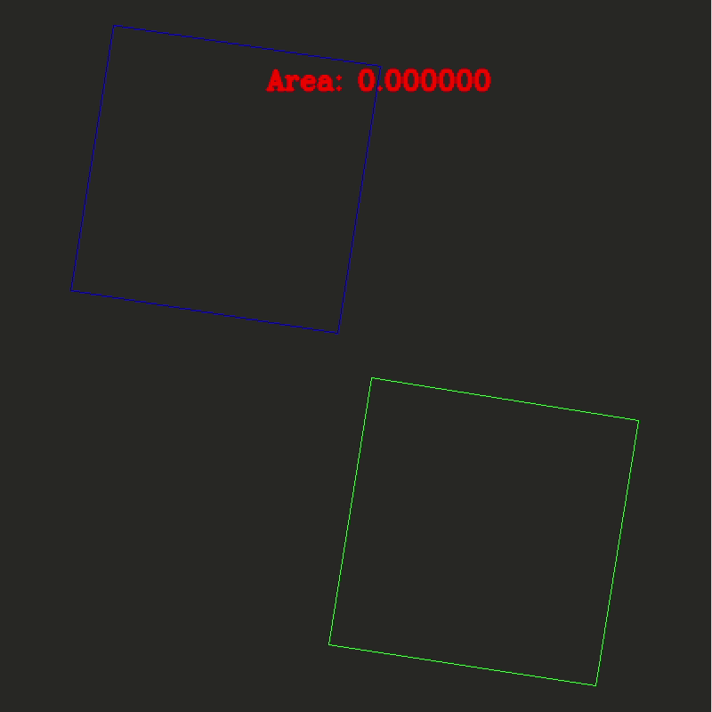

# CPL: Convex Polygon Library

## Brief

Header-only convex polygon library.

Supporting (for any convex polygon): 
- Clip operation:
  - [x] Intersection
  - [ ] Union

- Calculate Area:

## Demo

See examples/opencv_example.cc.

